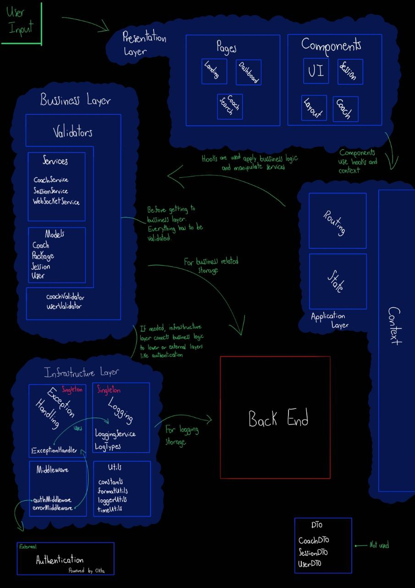
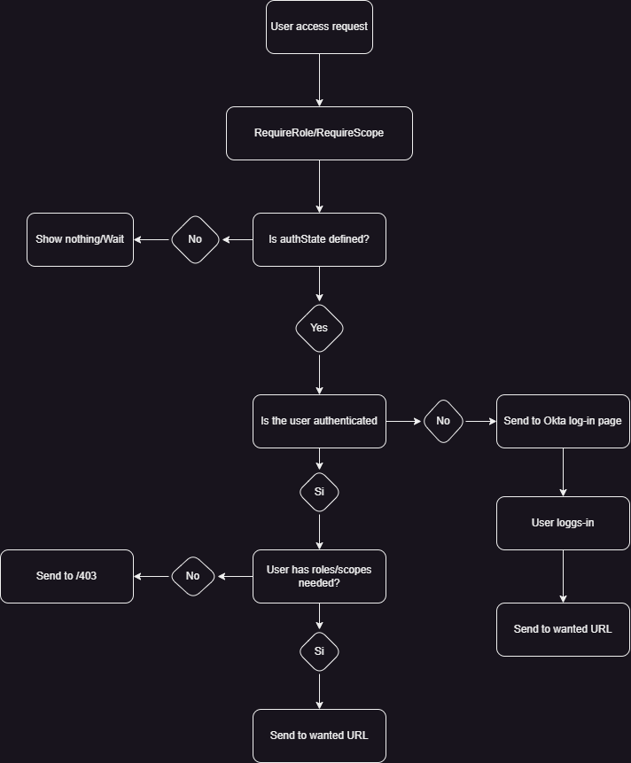

# 20MinCoach
This is the documentation of the design of **20MinCoach** which is described [here](https://github.com/vsurak/cursostec/tree/master/diseno).

### Table of Contents
- [General Design Features](#general-design-features)
- [Detailed Layer Design](#detailed-layer-design)

## General Design Features
This section describes general features of the platform's design, such as technologies used and architecture.

### Technology Research and Selection
For this platform `React 18` is going to be used as a Front-End library. Because this is a Single Page Application no framework is required. Everything is developt on Vite + React + TypeScript.

`React` provides flexibility, is very popular and allows scalability for projects of any size. React's Virtual DOM is a lightweight copy of the actual DOM, which allows it to efficiently update only the changed components rather than re-rendering the entire page. This results in faster rendering and smoother user experiences. 

`TailWind` in this platform is used as a CSS framework. It provides CSS utilities for quick web development and easy personalization. It is going to be used alongside `React`.

`Angular` is a complete framework that would stablish a pre-defined architecture. This would limit our freedom to implement extra features to the platform in a future. Plus it has a more "steep" learning curve, this affets our efficiency.

`Vue` for this case-scenario, is a better option than `Angular` because it provides more flexibility and is less complex. But `React` provides more freedom.

The following technologies will provide real-time communication:
`Lovable Cloud/Supabase Realtime` for instant notification in the platform and `Resend` for emails (reminders or confirmations)

For testing and linting `Vitest` and `ESLint` will be implemented. These two are going to be configured on a pipeline for auto testing and linting after every push into the repo.

The following **styling methodologies** are key features of this design:
- Utility-First CSS
- Design Tokens / CSS Variables
- Component Variants Pattern
- Mobile-First Responsive Design

`Tailwind CSS` is used as the primary styling framework with JIT compiler, `tailwindcss-animate` for pre-built animation utilities, `shadcn/ui` as a provider of pre-defined UI components and `class-variance-authority (CVA)` for Component Variants Pattern.

This creates a themeable, maintainable system where colors/styles are centralized and consistently applied across the platform.
### N-Layer Architecture Design
This architecture consist of four main layers:
- Presentation
- Application
- Bussiness
- Infrastructure

And an external layer of Authentication.

Independency between layers is our main goal in this architecture, therefore the `Presentation Layer` is only responsable for interactions with the user. Is made of the web pages and the components that are used in every page. In order to handle user inputs this layer interacts with the `Application Layer` which is in charge of routing between pages, handling the state of the platform and giving context to other entities.

`Application Layer` interacts directly with the `Bussiness Layer` which can be deffined as the core of this architecture, it encapsulates the domain logic, validates processes, holds models and provides services that represent the behavior of the platform. The `Infrastructure Layer` is an auxiliar for the interaction of the `Bussiness Layer` and the Back-End or extrenal services like the authentication.

The authentication is an external layer that can be exchange easily. At first this is provided by **Okta**.



If you want a pdf with more quality => [Case1Architecture.pdf](./diagrams/Case1Architecture.pdf)


### Visual Components Strategy

**Organization Strategy**

- Place generic reusable components inside [/src/components/ui](src/components/ui/) (e.g., `Button`, `Card`, `Alert`).
- Place layout components inside /src/components/layout(e.g., `Sidebar`, `MainLayout`).
- Place domain-specific components in their domain folder:
  - [/coach](src/components/coach)
  - [/session](src/components/session)

Never duplicate UI markup. Always extend from `ui/` primitives.

**Reusable Library Structure**

Extend only from `ui/` components. Example:
```tsx
import { Card, CardContent, CardFooter } from '@/components/ui/card';

<Card>
  <CardContent>…coach info…</CardContent>
  <CardFooter>
    <Button>Ver perfil</Button>
    <Button>Conectar ahora</Button>
  </CardFooter>
</Card>
```
Always use Tailwind tokens (bg-card, text-card-foreground, shadow-soft). Never use raw CSS values.

Keep accessibility defaults: ARIA attributes on interactive elements, focus styles, keyboard navigation enabled.

**Development Workflow**

- Create the component in the correct folder (ui/, coach/, session/).
- Define props for all dynamic data. Do not hardcode.
- Apply Tailwind classes using design tokens (`bg-background`, `text-foreground`, `shadow-[var(--shadow-soft)]`).
- Add responsive classes (`sm:`, `md:`, `lg:`) where needed.
- Ensure accessibility with ARIA roles and keyboard navigation.

**Testing Methodology**

- All tests are in [/src/test](src/test).
- Name tests after the component: ComponentName.test.tsx.
- Use `@testing-library/react` + `vitest`.
- Every test must check:
  - Props rendering (text, numbers, conditional labels).
  - Accessibility (ARIA roles, focus, labels).
  - Events (clicks, state toggles).
  - Variants (online/offline, active/inactive).

Example:
```tsx
render(<CoachCard coach={mockCoach} user={mockUser} />);
expect(screen.getByText('Coach de Liderazgo')).toBeInTheDocument();
```
## Detailed Layer Design

### Visual Components
All visual components are in [/src/components](src/components/).
Use them as building blocks, never re-invent styles.

**Cards**

Base card is defined in [/src/components/ui/card.tsx](src/components/ui/card.tsx)

It already includes `Card`, `CardHeader`, `CardContent`, `CardFooter`, `CardTitle`, `CardDescription`.

To build a domain card (e.g. coach profile), import and compose these parts.

Example – [CoachCard.tsx](src/components/coach/CoachCard.tsx):
```tsx
import { Card, CardContent, CardFooter } from '@/components/ui/card';

<Card>
  <CardContent>…coach info…</CardContent>
  <CardFooter>
    <Button>Ver perfil</Button>
    <Button>Conectar ahora</Button>
  </CardFooter>
</Card>
```

Always extend from ui/card.tsx. Do not duplicate card markup or styles.

**Sidebar**

The sidebar system is already implemented in [/src/components/layout/Sidebar.tsx](/src/components/layout/Sidebar.tsx).

Use `<SidebarProvider>` at the root, and `<Sidebar>`, `<SidebarContent>`, `<SidebarMenu>`, `<SidebarMenuItem>` etc. to build navigation.

Toggle is done with `<SidebarTrigger>`.

Responsive behavior is built in: desktop = fixed, mobile = overlay.

Example:
```tsx
<SidebarProvider>
  <Sidebar>
    <SidebarContent>
      <SidebarMenu>
        <SidebarMenuItem>
          <SidebarMenuButton isActive>Dashboard</SidebarMenuButton>
        </SidebarMenuItem>
      </SidebarMenu>
    </SidebarContent>
  </Sidebar>

  <SidebarInset>{children}</SidebarInset>
</SidebarProvider>

```

Never implement your own sidebar; always extend this system.

**Reusability and Accessibility**

- For new components, always place them in the right folder:
  - [ui/](src/components/ui) - generic reusable (e.g. `Button`, `Card`)
  - [coach/](src/components/coach) - coach domain components (e.g. [CoachCard](src/components/coach/CoachCard.tsx))
  - [session/](src/components/session) - session domain components

All interactive elements must have ARIA attributes:
```tsx
<button aria-label="Open sidebar" aria-expanded={isOpen}>Menu</button>
```

Keyboard accessibility: ensure tabIndex=0 on links and buttons.

**Responsiveness**

Use Tailwind breakpoints (`sm:`, `md:`, `lg:`) consistently.
Do not hardcode widths; use container/grid utilities.
Sidebar and Card components already include mobile - desktop transitions.

**Developer rules**

- No business logic in components. Data must come via props.
- Only use Tailwind tokens (colors, shadows, transitions) defined in [index](src/index.css). Never use raw hex values.
- Example of token usage:
```tsx
<div className="bg-card text-card-foreground shadow-[var(--shadow-soft)]">
  …
</div>
```
### Controllers

All controller logic is implemented as custom React hooks inside [/src/hooks](/src/hooks/).
These hooks connect UI components with domain services while following dependency injection principles.

**Dependency Injection**

Hooks must always call services via their singletons instead of hardcoding logic.
Example: `CoachService.getInstance()` is used inside a hook instead of directly importing fetch logic.
This keeps hooks testable and ensures consistency across the app.

**Available Hooks**

[use-mobile.tsx](src/hooks/use-mobile.tsx)– detects viewport size to handle responsive UI.
```tsx
const isMobile = useIsMobile();
<div className={isMobile ? "p-4" : "p-8"}>Responsive content</div>
```

use-toast.ts – manages toast notifications.
```tsx
const { toast } = useToast();
<Button onClick={() => toast({ title: "Profile saved!" })}>Save</Button>
```

[useLogger.ts](src/hooks/useLogger.ts)– connects UI with [LoggingService](src/logging/LoggingService.ts) and [ExceptionHandler](src/exceptionHandling/ExceptionHandler.ts).
```tsx
const { logUserAction, handleAsyncOperation } = useLogger();

logUserAction("Clicked Save Button");

await handleAsyncOperation(
  () => CoachService.getInstance().getCoachById("123"),
  "COACH",
  "fetch_by_id",
  user.id
);
```
Hooks that interact with services (e.g., [useLogger.ts](src/hooks/useLogger.ts)) must inject them via `Service.getInstance()`.
Utility hooks (e.g., [use-mobile.tsx](src/hooks/use-mobile.tsx), [use-toast.tsx](src/hooks/use-toast.ts)) don’t need dependency injection because they don’t depend on services.
**Rules for Developers**

- Do not place fetch/business logic inside components. Always wrap it in a hook.
- When you need service calls (e.g., coaches, sessions, auth), always inject via Service.getInstance().
- Hooks must only return state, callbacks, or utilities to the component.
- For errors, always go through useLogger.handleError or useLogger.handleAsyncOperation, never try/catch silently.
- Add new hooks inside [/src/hooks](src/hooks) following the same pattern.
### Model

All domain models live in [/src/models](src/models/).

They define the application entities and their structure. Models are pure data containers (no business logic).

- [User.ts](src/models/User.ts) – basic user info, role, preferences.
- [Coach.ts](src/models/Coach.ts) – coach profile, specialties, availability, certifications.
- [Session.ts](src/models/Session.ts) – scheduling, connection, payment, recording.
- [Package.ts](src/models/Package.ts) – session bundles with limits and validity.

When creating a new domain entity, add it as a TypeScript file inside [/src/models](src/models/) and keep it free of business logic.

**Model Validation**

Input validation is handled with Zod in [/src/validators](src/validators/).

Each validator enforces integrity rules for its corresponding model.

- [coachValidator.ts](src/validators/coachValidator.ts) – validates Coach input.
- [userValidator.ts](src/validators/userValidator.ts) – validates User input.

**Example**: Coach Validation
```ts
import { createCoachSchema } from '../validators/coachValidator';

const input = {
  bio: 'Experienced fitness coach with 10+ years in training.',
  headline: 'Fitness & Wellness Expert',
  specialties: ['HEALTH', 'PSYCHOLOGY'],
  experience: 10,
  pricePerSession: 50,
  availability: { timezone: 'America/Bogota', weeklySchedule: { monday: [] }, instantAvailable: true },
  languages: ['English', 'Spanish'],
};

const validCoach = createCoachSchema.parse(input);
```
The `.parse()` method throws detailed errors if the input is invalid. Always run `.parse()` before persisting or using external input.

**How to Work with Models & Validators**
- Models: only structure, no logic.
- Validators: keep them in [/src/validators](src/validators/) and use them in services or controllers before consuming data.
- Use `z.infer` to derive TypeScript types from schemas and prevent type drift.
- When adding a new model, always add a matching validator in [/src/validators](src/validators/).

### Middleware

All middleware lives in[src/middleware](src/middleware)

They centralize cross-cutting concerns like authentication, logging, and error handling. Middleware intercepts requests or events to apply policies before passing control to services or controllers.

- [authMiddleware.ts](src/middleware/authMiddleware.ts) – authentication, token refresh, role-based access control.
- [errorMiddleware.ts](src/middleware/errorMiddleware.ts)– standardizes error handling, converts exceptions to structured responses, logs errors.
- [transformers](src/middleware/transformers)– Maps DTOs to Models (e.g., [[coach.mapper.ts](src/middleware/transformers/coach.mapper.ts), [session.mapper.ts](src/middleware/transformers/session.mapper.ts), [user.mapper.ts](src/middleware/transformers/user.mapper.ts)).

**Applied Design Pattern**: Middleware / Interceptor Pattern.

Functions as a pipeline to intercept, validate, log, or transform requests/responses.

**Examples**
AuthMiddleware

```ts
const auth = new AuthMiddleware();
app.use((req, res, next) => auth.requireAuth(req, res, next));
```

- Checks access token and refreshes if expired.
- Supports role-based guards via `requireRole()`.

ErrorMiddleware

```ts
try {
  await someServiceOperation();
} catch (err) {
  const handled = ErrorMiddleware.createErrorHandler('SESSION')(err);
  console.error(handled);
}
```

- Wraps any service/controller operation.
- Produces standardized error responses with timestamp, correlationId, code, and message.
- Logs errors and security events via the [Logging layer](src/logging/LoggingService.ts).

**How to Work with Middleware**

- Middleware should not contain business logic; that belongs in services.  
- Middleware must remain stateless. If shared state is needed (e.g., logging or exception handling), implement it in the corresponding service and inject it into middleware.  
- Use transformers to map incoming DTOs to models, keeping controllers/services clean.  
- Use `ErrorMiddleware.createErrorHandler` to standardize error handling across services.  

### Business

**Location**: [src/business](src/business)

**Purpose:**

Centralize the domain-specific rules and business validations that define how the system behaves beyond data structure or persistence. This layer encapsulates the core logic of the domain, ensuring that models (data) and services (integration/API) respect the business constraints of the application.

**Domain Driven Design (DDD) Theory**:

Domain Driven Design promotes the separation of concerns by isolating domain logic into its own layer. Instead of mixing rules into [models](src/models) or [services](src/services), business logic resides in [business](src/business). This makes rules reusable, testable, and easier to evolve as requirements change.

**Technology for TypeScript/React stack**:

- `TypeScript` - allows us to enforce domain types and constraints at compile-time.
- `Zod` (already explained in [model](#Model)) - complements by enforcing runtime validation.
- `Business Rules` - will be implemented in the [business](src/business) folder, decoupled from UI and API integration.

**Examples of future Domain-Specific Rules**:

SessionRules.ts

```ts
import { Session } from '../models/Session';

export function canScheduleSession(session: Session): boolean {
  const now = new Date();
  return (
    session.scheduledAt > now &&
    session.duration >= 15 &&
    session.duration <= 180
  );
}
```

PackageRules.ts

```ts
import { Package } from '../models/Package';

export function isPackageValid(pkg: Package): boolean {
  return pkg.sessions > 0 && pkg.validUntil > new Date();
}
```

**Implementation Templates**:

Developers can create new business rules by:

1. Importing the related model.
2. Defining a pure function (no side effects) that encodes the rule.
3. Returning a boolean, a transformed object, or throwing an error depending on the business requirement.

```ts
//Example for future UserRules.ts
import { CreateUserInput } from '../validators/userValidator';

export function canRegisterAsCoach(user: CreateUserInput): boolean {
  const age =
    new Date().getFullYear() - new Date(user.dateOfBirth).getFullYear();
  return user.role === 'COACH' ? age >= 18 : true;
}
```

**Developer Guidelines:**

- Keep models pure - only structure, no logic.
- Use [validators](src/validators) only for input validation (runtime safety).
- Always reference business rules from [services](src/services) to ensure consistent enforcement across the app.

### Services (not documented yet)

Design API client abstraction layer, providing templates of how APis are going to be integrated into the future. Me parece que hay que crear un tipo de diagrama para esto.
Create the client for the security layer, this is going to be functional code. Este me parece que ya está.

### Background/Jobs/Listeners

**Location:**

```tsx
src/
  background/
    events/
      eventBus.ts               
      types.ts                  
    listeners/
      wsClient.ts               
      sessionListener.ts               
    jobs/
      polling.ts                
      visibilitySync.ts         
    sw/
      service-worker.ts         
      swRegistration.ts         
    notifications/
      pushClient.ts             
```

***How to start/plug in the layer in our application***

```tsx

import { wsClient } from "@/background/listeners/wsClient";
import { attachSessionListener } from "@/background/listeners/sessionListener";
import { startLightPolling } from "@/background/jobs/polling";
import { attachVisibilitySync } from "@/background/jobs/visibilitySync";
//import { registerSW } from "@/background/sw/swRegistration";

const disposers: Array<() => void> = [];

function bootBackground(queryClient: QueryClient) {
  //WebSocket + listeners
  wsClient.connect();
  disposers.push(() => wsClient.close());
  disposers.push(attachSessionListener());

  //Light polling and revalidation on focus/online
  disposers.push(startLightPolling(queryClient));
  disposers.push(attachVisibilitySync(queryClient));

  //Service worker
  //registerSW();
}

//when mounting the <App/> (you already pass QueryClient):
bootBackground(queryClient);

//when disassembling (if HMR or cleanup applies):
if (import.meta.hot) {
  import.meta.hot.dispose(() => disposers.forEach(d => d()));
}


```


This layer is isolated in `src/background/`, with sample code and documentation for the team to extend when integrating the 20minCoach background layer (live sessions, coach presence, notifications, etc.), or designing a future mobile version.


### DTOs

At 20minCoach, we never want to couple the UI with the raw format of the backend, for two reasons:

- The backend may use different field names (snake_case) and formats that aren't ideal for the UI (dates as ISO strings, ambiguous flags, etc.).
- If the backend changes, we don't want to break the entire UI. The change should be contained in a single place.

Use only within `src/services/` (raw requests/responses) and `src/middleware/transformers/` (mappings).
Ex: the backend sends created_at as an ISO string → that's a DTO.

If you need a DTO in the UI, something is wrong: add a mapper.

Mappers are invoked on services:

```tsx
//CoachService.ts

async getCoachById(id: string): Promise<Coach> {
  const res = await fetch(`${this.baseUrl}/${id}`, { headers: this.getAuthHeaders() });
  if (!res.ok) throw new Error('Failed to fetch coach');
  const dto = await res.json();
  return coachMapper.fromDTO(dto); // <- mapping
}
```

there are templates of mappers on this folder - [transformers](src/middleware/transformers)


***DTO-light policy:*** 

keep DTOs only where a transformation is actually needed.
- If an endpoint already returns the exact shape you want, the service can return it as is (after a Zod .parse()), no mapper file.
- If any field needs conversion (date parsing, renames, coercions), create a small mapper for that endpoint’s payload and keep DTO types private to the service layer.


### Styles

The UI is styled with Tailwind CSS. Design tokens (HSL CSS variables) live in `src/index.css` under `:root` (light) and `.dark` (dark). Tailwind maps those tokens to semantic classes `bg-background`, `text-foreground`, `bg-primary`, `bg-card`, etc. so components don’t hard-code colors or write custom CSS for theme switching.

**How you should write styles here:**

- Prefer semantic Tailwind classes bound to tokens: `bg-background`, `text-foreground`, `border-border`, `bg-primary text-primary-foreground`, `bg-card text-card-foreground`.

- Build mobile-first; add breakpoints only where layout needs them: `sm:`, `md:`, `lg:`, `xl:`. Use `grid`, `flex`, `gap`, `w-full`, `max-w-*`, `min-w-0`.

- Keep accessibility by default: semantic HTML elements, visible focus rings (don’t remove them), adequate contrast (foreground/background pairs), and keyboard operability.

- When you repeat the same utility cluster more than twice. Use props for variants; keep styling expressed in Tailwind classes.

- Only add a small CSS Module next to a component if utilities become unwieldy (rare).

***Dark/Light mode — what you do vs. what the app does:***

- The app toggles dark mode by adding/removing `.dark` on `<html>`. The tokens in `index.css` change values under that class.

- You, in components, just use the semantic classes listed above. Do not write conditional color logic or theme checks in components; if a color looks wrong, you likely bypassed tokens.

***Responsiveness — practical rules:***

- Start with the smallest layout: base classes without prefixes. Enhance with `sm:` and up.

- Prefer responsive grids/lists over fixed widths; bump columns at larger breakpoints.

- Preserve focus styles from `index.css` (they already work in both themes). For icon-only buttons, add an `aria-label`. Keep touch targets comfortable with padding.

**Component template**

```tsx

type InfoCardProps = {
  title: string;
  children: React.ReactNode;
  onAction?: () => void;
  actionLabel?: string; //required if onAction is provided
};

export function InfoCard({ title, children, onAction, actionLabel }: InfoCardProps) {
  return (
    <section
      className="bg-card text-card-foreground rounded-lg shadow-[var(--shadow-soft)] p-4 sm:p-6"
      aria-label={title}
    >
      <header className="flex items-start justify-between gap-4">
        <h3 className="text-base sm:text-lg font-semibold leading-tight">{title}</h3>
        {onAction && (
          <button
            type="button"
            onClick={onAction}
            className="inline-flex items-center rounded-md bg-primary px-3 py-2 text-sm text-primary-foreground transition-[background-color] duration-200 ease-[var(--transition-smooth)] hover:bg-primary/90"
            aria-label={actionLabel}
          >
            Action
          </button>
        )}
      </header>

      <div className="mt-3 sm:mt-4 grid gap-3">{children}</div>
    </section>
  );
}


```


### Utilities

Decision for this project:

- Keep constants, formatUtils, timeUtils as stateless modules (no Singleton).
- Provide one Singleton only where it adds value: a logger with global config and consistent output.

you can see the example on this file [LoggerUtils.ts](src/utils/loggerUtils.ts)

Usage anywhere

```tsx
import { logger } from '@/utils/loggerUtils';

logger.info('Fetching coach', { coachId: id });
// later, if you need more verbosity in dev:
import { Logger } from '@/utils/loggerUtils';
Logger.getInstance().setLevel('debug');
```

### Exception Handling

The idea of this layer is to transform/process exceptions or errors generated at the lower levels so that they become readable and user-friendly, prioritizing that their occurrence does not affect the logic of the rest of the program. It also serves as a framework for the logging layer, especially for the generation of error-related logs.

[ExceptionHandler.ts](src/middleware/ExceptionHandler.ts) is the class in charge of processing all exceptions

This class implements a Singleton pattern since only one instance of the class is needed.

```ts
static getInstance(): ExceptionHandler {
    if (!ExceptionHandler.instance) {
      ExceptionHandler.instance = new ExceptionHandler();
    }
    return ExceptionHandler.instance;
  }
```

The following method is the core of this class. It logs errors, transforms them to uniform objects returned as HandleException, therefore only friendly and meaningful mesagges are shown to the user. It also adapts messages deppending to each category (SESSION, PAYMENT, VIDEO, etc.) and enriches with metadata in order to provide helpful log messages.

```ts
handleException(
    error: Error | any,
    context: ExceptionContext
  ): HandledException {
    const correlationId = this.generateCorrelationId();
    const timestamp = new Date().toISOString();

    // Log the exception with appropriate category
    this.logger.logError(error, context.category, JSON.stringify({
      operation: context.operation,
      userId: context.userId,
      sessionId: context.sessionId,
      correlationId,
      ...context.additionalInfo,
    }));

    // Create standardized exception response
    const handledException: HandledException = {
      message: this.getErrorMessage(error, context),
      code: this.getErrorCode(error, context),
      details: this.getErrorDetails(error),
      timestamp,
      correlationId,
    };

    // Log security events for authentication/authorization errors
    if (this.isSecurityRelated(error)) {
      this.logger.logSecurity('security_exception', {
        ip_address: 'unknown', // Would be provided by backend
        user_agent: navigator.userAgent,
        attempt_type: context.operation,
        success: false,
        user_id: context.userId,
      });
    }
```

**correlationId** allows an error trace from the client to server logs.

Custom user-messages are generated in the following method (there are other messages for different error types).

```ts
private getErrorMessage(error: any, context: ExceptionContext): string {
    // Network errors
    if (!navigator.onLine) {
      return 'Sin conexión a internet. Verifica tu conexión y vuelve a intentar.';
    }

    // HTTP errors
    if (error.response) {
      const status = error.response.status;

      switch (status) {
        case 400:
          return this.getBadRequestMessage(context);
        case 401:
          return 'Tu sesión ha expirado. Por favor, inicia sesión nuevamente.';
        case 403:
          return 'No tienes permisos para realizar esta acción.';
        case 404:
          return this.getNotFoundMessage(context);
        case 409:
          return this.getConflictMessage(context);
        case 422:
          return 'Los datos proporcionados no son válidos. Revisa la información e intenta nuevamente.';
        case 429:
          return 'Demasiadas solicitudes. Por favor, espera unos momentos antes de intentar de nuevo.';
        case 500:
          return 'Error interno del servidor. Nuestro equipo ha sido notificado.';
        case 503:
          return 'El servicio está temporalmente no disponible. Intenta más tarde.';
        default:
          return `Error inesperado (${status}). Si el problema persiste, contacta al soporte.`;
      }
    }

    // Timeout errors
    if (error.code === 'ECONNABORTED') {
      return 'La operación tardó demasiado tiempo. Verifica tu conexión e intenta nuevamente.';
    }

    // Category-specific error messages
    return this.getCategorySpecificMessage(error, context);
  }
```

### Logging

This logging layer is designed to provide request, conectivity and user interaction tracking.
It provides a source of data for future business intelligence metrics scoped to enhance user experience.

Log flow


[LoggingService.ts](src/logging/LoggingService.ts): centralized logging class that standardizes how logs are created, buffered, and sent to the backend system in this design.

It follows the Singleton pattern to ensure that the entire application uses the same logging instance with a shared configuration.

After their creation logs are stored in a buffer `logBuffer`.  
Automatically flushes when the buffer reaches the configured batch size or a periodic timer `flushTimer` triggers after `flushInterval`.

```ts
private addLog(log: LogEntry): void {
    this.logBuffer.push(log);

    // Console logging in development
    if (this.config.enableConsole && this.config.environment === 'development') {
      this.logToConsole(log);
    }

    // Flush if buffer is full
    if (this.logBuffer.length >= this.config.batchSize) {
      this.flush();
    }
  }
```

**In Development**: Logs are shown in the browser console `logToConsole`.

```ts
private logToConsole(log: LogEntry): void {
    const logMessage = `[${log.timestamp}] ${log.level} [${log.category}] ${log.event_type}`;

    switch (log.level) {
      case 'ERROR':
        console.error(logMessage, log.type_info);
        break;
      case 'WARN':
        console.warn(logMessage, log.type_info);
        break;
      case 'DEBUG':
        console.debug(logMessage, log.type_info);
        break;
      default:
        console.info(logMessage, log.type_info);
    }
  }
```

**In Production**: Logs are sent in bulk to a backend endpoint.

```ts
private async flush(): Promise<void> {
    if (this.logBuffer.length === 0) return;

    const logsToFlush = [...this.logBuffer];
    this.logBuffer = [];

    try {
      await this.sendLogsToBackend(logsToFlush);
    } catch (error) {
      console.error('Failed to send logs to backend:', error);
      // In a real app, you might want to retry or store locally
    }
  }

  private async sendLogsToBackend(logs: LogEntry[]): Promise<void> {
    // In production, this would send to ElasticSearch or your logging endpoint
    if (this.config.environment === 'production') {
      const response = await fetch('/api/logs', {
        method: 'POST',
        headers: {
          'Content-Type': 'application/json',
        },
        body: JSON.stringify({ logs }),
      });

      if (!response.ok) {
        throw new Error(`Failed to send logs: ${response.statusText}`);
      }
    } else {
      // In development, just log to console
      console.group('📊 Batch Logs Flush');
      logs.forEach(log => this.logToConsole(log));
      console.groupEnd();
    }
  }
```

Log Types and Tags

| Category     | Description            | Tag        |
| ------------ | ---------------------- | ---------- |
| **SESSION**  | Video session logs     | INFO/DEBUG |
| **PAYMENT**  | Financial transactions | WARN/ERROR |
| **USER**     | User actions           | INFO       |
| **COACH**    | Coach actions          | INFO       |
| **MATCHING** | Matching algorithm     | DEBUG      |
| **VIDEO**    | Video quality metrics  | ERROR/WARN |

Log Structure

The creation of these log types is declared in this file => [LogTypes.ts](src/types/LogTypes.ts)

Base Log Information

```ts
export interface BaseLog {
  timestamp: string;
  level: LogLevel;
  category: LogCategory;
  event_type: string;
  location: string;
  type_info: Record<string, any>;
}
```

This info is going to be present on every log type. No matter what tag it has.
**type_info** is going to be extra information related to the log type and tag.

COACH, USER and SESSION logs are considered simple logs, these usually inform of session initialization or users log-Ins.
Therefore **type_info** wont add relevant information to these logs.

```ts
export interface StandardLog extends BaseLog {
  type_info: {};
}
```

The following types are considered complex logs. Therefore **type_info** is defined as such:

PAYMENT

```ts
export interface PaymentLog extends BaseLog {
  category: 'PAYMENT';
  type_info: {
    user_id: string;
    package_type: string;
    amount: number;
    currency: string;
    payment_method: string;
    transaction_id: string;
    remaining_sessions: number;
    country: string;
  };
}
```

MATCHING

```ts
export interface MatchingLog extends BaseLog {
  category: 'MATCHING';
  type_info: {
    user_id: string;
    requested_specialty: string;
    matched_coaches: string[];
    matched_coach: string;
    matching_duration_ms: number;
    matching_criteria: {
      rating: number;
      proximity: number;
      response_time: number;
    };
  };
}
```

VIDEO

```ts
export interface VideoLog extends BaseLog {
  category: 'VIDEO';
  type_info: {
    session_id: string;
    metrics: {
      bitrate_kbps: number;
      packet_loss: number;
      jitter_ms: number;
      resolution: string;
      audio_level: number;
    };
    participants: string[];
  };
}
```

Logs Storage and Visualization

This will be achieved with the implementation of ELK (ElasticSearch, Logstash and Kibana).
ElasticSearch will be used as an indexation and storage tool where the index of each log will be its date and time of insertion. No normalization will be needed before the indexation of each log, since there is a structure pre-defined. Logstash will be used only for enrichment purposes.
Kibana will display log data through charts, graphs, and tables to identify trends, anomalies, and potential issues.

For long-term compliance and cost optimization, logs are archived into **Amazon S3**.  
This ensures that older logs remain accessible for investigation, audits, and regulatory requirements, while reducing the load on ElasticSearch.
S3 lifecycle rules automatically move objects to Glacier/Deep Archive for further cost reduction.

Retention and Storage Strategy
Once a log is considered cold storage it'll be transfered to S3.
The time after the last indexation in order to considered a "log-cold" storage vary for each category.

| Category     | Time Until Cold |
| ------------ | --------------- |
| **SESSION**  | 30 days         |
| **PAYMENT**  | 6 months        |
| **USER**     | 6 months        |
| **COACH**    | 6 months        |
| **MATCHING** | 30 days         |
| **VIDEO**    | 30 days         |
| **SECURITY** | 6 months        |

### Security

Okta is the service we chose to manage the platform’s authentication.
The code related to this service is located in the following folder: [auth](src/auth)

In this folder, the file [oktaConfig.ts](src/auth/oktaConfig.ts)
configures the Okta authentication client with the credentials and security parameters defined as environment variables, it returns a function that redirects the user back to the original page after logging in.

[OktaProvider.tsx](src/auth/OktaProvider.tsx) is a React component that authenticates the user when trying to access a page. After a successful login, Okta redirects the user to the route they originally attempted to visit.
This way, any protected route can automatically verify whether the user is logged in or not.

```tsx
export default function OktaProvider({ children }: PropsWithChildren) {
  const navigate = useNavigate();
  return (
    <Security
      oktaAuth={oktaAuth}
      restoreOriginalUri={buildRestoreOriginalUri(navigate)}
    >
      {children}
    </Security>
  );
}
```

`oktaAuth` (authentication client) and `buildRestoreOriginalUri()` (function in charge of redirecting the user) come from [oktaConfig.ts](src/auth/oktaConfig.ts).

[RequireRole.tsx](src/auth/RequireRole.tsx) implements a React hook and component to handle role-based authorization using Okta and React Router. This component protects routes and ensures that only users with certain roles can access them.

While Okta determines whether the user is logged in, we do nothing. This prevents displaying content before knowing the actual state.

```ts
if (authState?.isAuthenticated === undefined) {
  return null; //o un spinner
}
```

If the user is not authenticated, they are redirected to `/login`, and a query parameter is added with the original route so that, after logging in, they can return to where they were.

```ts
if (!authState?.isAuthenticated) {
  const target = `/login?from=${encodeURIComponent(location.pathname)}`;
  return <Navigate to={target} replace />;
}
```

The user’s roles are extracted and checked to see if any of them match the allowed roles `(anyOf)`.
If there is no match, the user is redirected to `/403` (Forbidden).

```ts
const roles = ((authState.idToken?.claims as any)?.roles as string[]) ?? [];
const ok = roles.some((r) => anyOf.includes(r));
if (!ok) return <Navigate to="/403" replace />;
```

If all validations pass, the child component is rendered.

```ts
return children;
```

[RequireScope.tsx](src/auth/RequireScope.tsx) implements scope-based protections. It is very similar to `RequireRole.tsx`, but here the focus is on the access token scopes, not the roles.

```ts
export function hasAllScopes(
  scopesStr: string[] | undefined,
  required: string[]
) {
  if (!scopesStr) return false;
  const set = new Set(scopesStr);
  return required.every((s) => set.has(s));
}
```

`scopesStr` contains the user’s scopes present in the access token, and `require` represents the scopes needed to access the route or resource. This function returns `true` only if all the required scopes are included in `scopesStr`.

`hasAllScopes` is used as the foundation for other functions, which, depending on certain criteria, will determine whether the user is allowed to access the requested route or not.

```ts
export default function RequireScope({
  scopes,
  children,
  redirectTo = '/403',
  forceLogin = false, // si quieres forzar formulario aunque haya SSO
}: {
  scopes: string[];
  children: JSX.Element;
  redirectTo?: string;
  forceLogin?: boolean;
}) {
  const { oktaAuth, authState } = useOktaAuth();
  const location = useLocation();
  const redirectingRef = useRef(false);

  // scopes del access token
  const tokenScopes = (authState?.accessToken?.claims as any)?.scp as
    | string[]
    | undefined;

  // Si NO autenticado → ir directo a Okta y volver a la URL actual
  useEffect(() => {
    if (authState?.isAuthenticated === false && !redirectingRef.current) {
      redirectingRef.current = true;
      const originalUri = location.pathname + location.search + location.hash;
      oktaAuth.signInWithRedirect({
        originalUri,
        extraParams: forceLogin ? { prompt: 'login', max_age: '0' } : undefined,
      });
    }
  }, [authState?.isAuthenticated, oktaAuth, location, forceLogin]);

  if (authState?.isAuthenticated === false) {
    // Evita render mientras Okta redirige
    return null;
  }

  if (authState?.isAuthenticated && !hasAllScopes(tokenScopes, scopes)) {
    return <Navigate to={redirectTo} replace />;
  }

  return children;
}
```

`RequireScope` allows user access only if it has all scopes needed.

```ts
export function RequireAnyScope({
  anyOf,
  children,
  redirectTo = '/403',
}: {
  anyOf: string[];
  children: JSX.Element;
  redirectTo?: string;
}) {
  const { authState } = useOktaAuth();
  const tokenScopes = (authState?.accessToken?.claims as any)?.scp as
    | string[]
    | undefined;
  const ok = !!tokenScopes && anyOf.some((s) => new Set(tokenScopes).has(s));
  return ok ? children : <Navigate to={redirectTo} replace />;
}
```

`RequireAnyScope` allows user access if the user has at least one of the scopes needed.

```ts
export function RequireAuthenticated({
  children,
  forceLogin = false,
}: {
  children: JSX.Element;
  forceLogin?: boolean;
}) {
  return (
    <RequireScope scopes={[]} forceLogin={forceLogin} redirectTo="/403">
      {children}
    </RequireScope>
  );
}
```

`RequireAuthenticated` protects routes only with login, regardless of scopes. This applies in cases where a page is declared as public and can be accessed by any user, regardless of their permissions.

Below is a diagram that illustrates the flow followed by an access request made by the user in the established design:



### Linter Configuration

The linting strategy in this project combines ESLint and Prettier to ensure consistent, clean, and maintainable code.
We chose to add Prettier to a ESLint setup in order to format code to a consistent style (indentation, quotes, semicolons, trailing commas, etc.).
Prettier runs as an ESLint rule, so formatting errors are reported alongside other lint errors.

**ESLint and Prettier Configuration**
1. Install ESLint
```bash
npm install eslint --save-dev
```
2. Install Prettier
```bash
npm install --save-dev --save-exact prettier
```
3. Integrate ESLint with Prettier
```bash
npm install --save-dev eslint-config-prettier eslint-plugin-prettier
```
- **eslint-config-prettier** disables ESLint rules that may conflict with Prettier.
- **eslint-plugin-prettier** runs Prettier as an ESLint rule, reporting formatting issues as linting errors.

4. Update `eslint.config.js` with:
```js
{
  "extends": [
    "eslint:recommended",
    "plugin:prettier/recommended"
  ],
  "plugins": ["prettier"],
  "rules": {
    "prettier/prettier": "error"
  }
}
```
If any exceptions are needed consider adding `'~~-~~/~~': 'off'`

5. Create `.prettierrc.json` and add:
```json
{
  "semi": true,
  "singleQuote": true,
  "printWidth": 80,
  "tabWidth": 2,
  "trailingComma": "es5",
  "bracketSpacing": true,
  "arrowParens": "always"
}
```

6. Add scripts for convenience
```json
{
  "scripts": {
    "lint": "eslint .",
    "lint:fix": "eslint . --fix",
    "format": "prettier --write ."
  }
}
```

**ESLint on Flat-Config**

- The project uses ESLint Flat Config, a modern ESM-based configuration replacing the traditional `.eslintrc.*`.
- Configuration is in [eslint.config.js](src\eslint.config.js) and defines:
  - Files to analyze: `**/*.{ts,tsx}`
  - Ignored folders: `dist` (Vite build output)
  - Plugins:
    - `react-hooks` → enforces correct use of React hooks
    - `react-refresh` → ensures compatibility with Vite Hot Reload
    - `prettier` → allows Prettier to enforce formatting rules through ESLint

Base rules: `eslint:recommended` and `typescript-eslint/recommended`

This is the code responsible of setting these ESLint params

```js
export default tseslint.config(
  { ignores: ['dist'] },
  {
    extends: [
      js.configs.recommended,
      ...tseslint.configs.recommended,
      eslintConfigPrettier,
    ],
    files: ['**/*.{ts,tsx}'],
    languageOptions: {
      ecmaVersion: 2020,
      globals: globals.browser,
    },
    plugins: {
      'react-hooks': reactHooks,
      'react-refresh': reactRefresh,
      prettier,
    },
    rules: {
      ...reactHooks.configs.recommended.rules,
      'react-refresh/only-export-components': [
        'warn',
        { allowConstantExport: true },
      ],
      '@typescript-eslint/no-explicit-any': 'off',
      '@typescript-eslint/no-unsafe-function-type': 'off',
      '@typescript-eslint/no-unsafe-declaration-merging': 'off',
      '@typescript-eslint/no-empty-object-type': 'off',
      '@typescript-eslint/no-unused-vars': 'off',
      'react-refresh/only-export-components': 'off',
      'prettier/prettier': 'error',
    },
  }
);
```

**Prettier**

- Automatically formats all `.ts` and `.tsx` files.
- Rules defined in `.prettierrc.json`:
  - Single quotes (')
  - Semicolons (;)
  - 2-space indentation
  - Max line width: 80 characters
  - Trailing commas for objects/arrays in multiline
  - Always use parentheses in arrow functions

This is the code responsible of setting these Prettier params

```json
{
  "semi": true,
  "singleQuote": true,
  "printWidth": 80,
  "tabWidth": 2,
  "trailingComma": "es5",
  "bracketSpacing": true,
  "arrowParens": "always"
}
```

**Naming Conventions**:
Classes, interfaces, types and enum members are named using the `PascalCase` convention.
`camelCase` is used for the names of variables and functions.

**Linting Commands**:
`npm run lint` checks all files and reports errors/warnings, `npm run lint:fix` fixes automatically correctable issues, including Prettier formatting.
If you want to format the entire project according to Prettier rules use `npm run format` this formatting is independent of ESLint.


### Build and Deployment Pipeline
Continuous integration is achieved with the implementation of a pipeline => [ci-cd.yml](./.github/workflows/ci-cd.yml).
This pipeline is in charge only of CI, CD (continuous deployment) is achieved with Vercel.

```yml
jobs:
  # -----------------------------
  # CI: Build + Test
  # -----------------------------
  build-and-test:
    runs-on: ubuntu-latest

    steps:
      - name: Checkout code
        uses: actions/checkout@v3

      - name: Setup Node.js
        uses: actions/setup-node@v3
        with:
          node-version: 20
          cache: 'npm'

      - name: Install dependencies
        run: npm ci

      - name: Run lint
        run: npm run lint

      - name: Run tests
        run: npm run test

      - name: Build project
        run: npm run build
```
This pipeline builds and tests the project. `vitest` is used for unit tests and `ESLint` is used for linting.
The configuration of the linting tool is described in the previous layer.

`vitest` tests files are located on [test](./src/test) in this files we have three tests. One for CoachCard, MainLayout and SessionCard.

After every `push` a Git Action is going to be excecuted. This process can be checked on the `Action` window in GitHub. If everything is ok and steps are passed successfully Vercel will start de deployment stage automatically. `link-here`.
