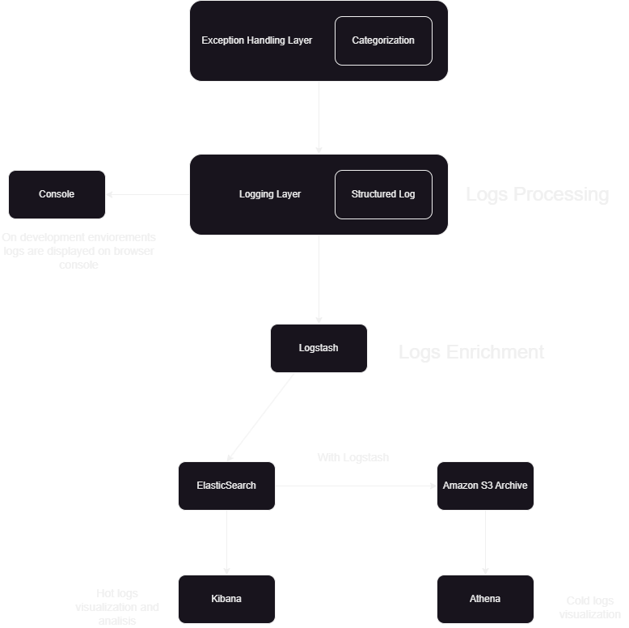

# 20MinCoach

Este va a ser el principal documento encargado de la documentación del Caso 1.


## Tabla de Contenidos
- [Diseño](#diseño)

## Diseño
Esta sección se encarga de definir y explicar el diseño que se seguirá en la realización del Caso 1.

(En el enunciado esta sección se divide en dos: Design Document y Detailed Layer Design Requirements.
Así que nosotros también la vamos a dividir en dos, en cada sección o sub-sección de este documento agragaremos la "respuesta" o lo que pide 
su respectiva sección del enunciado. Las voy a enlistar...)

(Más adelante podríamos cambiarle los nombres a estas secciones. De momento le pongo estos para mantener la claridad)
### Design Document
(Esta seccion se divide en tres apartados: Technology Research and Selection, N-Layer Architecture Design y Visual Components Strategy)

#### Technology Research and Selection
A rasgos generales esta sección pide hacer una investigación sobre las tecnologías que vamos a utilizar en nuestro diseño:

- Research modern frontend frameworks and libraries
- Compare technologies such as React, TailWind, Vue, Angular and similar for this specific use case
- Evaluate state management solutions such as Redux or Mutex
- Research real-time communication technologies (WebRockets, WebRTC, Notification Services)
- Select testing frameworks and tools
- Choose styling methodologies and tools
- Choose a linter and unit test technology
- Document your technology choices with justification

El último "task" nos indica lo que agregaremos a esta sección. Tratemos de ser concisos. No ingresemos documentación innecesaria
pero brindemos una buena justificación. Esta sección no debería de ser muy larga. Solo para indicarle al "programador" lo que se utiliza
en este diseño.

#### N-Layer Architecture Design
Acá va el diagrama de layers.
Talvez podríamos mostrar los layers con cajas y relacionarlos con flechas. Sería bueno tratar de agregarles un par de patrones de diseño
para la comunicación entre ellos.
Por ahí podríamos agregar un listado de las responsabilidades de cada layer abajo del diagrama.

Document this before the architecture diagram. <- Talvez podríamos acomodar el diagrama de clases abajo de la lista de responsabilidades.

#### Visual Components Strategy
Esta sección no me quedó muy clara la verdad: 
- Develop a component organization strategy, this might be lead by the technology choose
- Design how to achive a reusable component library structure, those are steps for the developers
- Create a component development workflow based on the technology selected, those are steps for the developers
- Establish component testing methodology, this is not theory, are steps for the developers

### Detailed Layer Design Requirements
Esta sección indica las especificaciones esperadas de cada layer. Estrategias que el profe espera que apliquemos en los layers.
#### Visual Components
**Location** : [src/PoC/src/components](src/PoC/src/components)

**Purpose** :Centralize the visual structure of the application, composing layouts, domain-specific components, and reusable UI components under principles of consistency, accessibility, and responsiveness.

**Folder Hierarchy**

- ui/ base reusable components ([View ui folder](src/PoC/src/components/ui))

- layout/ global layouts ([View layouts folder ](src/PoC/src/components/layout))

- coach/  domain-specific components for coaches ([View coach folder ](src/PoC/src/components/coach))

- session/  domain-specific components for sessions ([View session folder ](src/PoC/src/components/session))

**Applied Design Pattern** : Composite Pattern

The [main layout ](src/PoC/src/components/layout/MainLayout.tsx) acts as a Composite, organizing and composing subcomponents ([header](src/PoC/src/components/layout/Header.tsx)), ([sidebar ](src/PoC/src/components/layout/Sidebar.tsx)) along with the dynamic page content (children).

- PageContent is dynamically injected via React Router and corresponds to any file inside [src/pages ](src/PoC/src/pages/). These are the actual screens rendered inside the layout.

Example: [main layout ](src/PoC/src/components/layout/MainLayout.tsx)
```tsx
export const MainLayout = ({ children, user, currentPath }: MainLayoutProps) => {
  const [sidebarOpen, setSidebarOpen] = useState(false);

  return (
    <div className="min-h-screen bg-background">
      <Header 
        user={user}
        onMenuClick={() => setSidebarOpen(!sidebarOpen)}
        notifications={3}
      />
      
      <div className="flex">
        <Sidebar 
          isOpen={sidebarOpen}
          userRole={user?.role}
          currentPath={currentPath}
        />
        
        <main className="flex-1 lg:ml-64">
          <div className="container max-w-7xl mx-auto p-6">
            {children}
          </div>
        </main>
      </div>
    </div>
  );
};
```

  

**Reusability Guidelines**

- Generic components - [ui](src/PoC/src/components/ui/)
- Domain-specific components - [coach](src/PoC/src/components/coach/) or [session](src/PoC/src/components/session/)
- Global layouts - [layout](src/PoC/src/components/layout/)

**Accessibility**

- Buttons and inputs should include ARIA attributes (aria-label, aria-expanded, etc.).
- All interactive elements must be keyboard accessible (tabIndex).
- Minimum contrast ratio: 4.5:1 (WCAG 2.1).

**Responsiveness**

- Tailwind breakpoints (sm:, md:, lg:) are used throughout.
- Example from [main layout ](src/PoC/src/components/layout/MainLayout.tsx):
```tsx
<main className="flex-1 lg:ml-64">
  <div className="container max-w-7xl mx-auto p-6">
    {children}
  </div>
</main>
```
- Sidebar switches from fixed (lg:ml-64) to mobile overlay depending on viewport.

**Developer Rules**

1. Generic - [ui](src/PoC/src/components/ui/)

2. Domain-specific - [coach](src/PoC/src/components/coach/) or [session](src/PoC/src/components/session/)

3. Global layout - [layout](src/PoC/src/components/layout/)

4. Every component must be:

    - Responsive

    - Accessible

    - Free of business logic (business logic lives in [services](src/PoC/src/services/))
#### Controllers
**Location** : [src/PoC/src/hooks](src/PoC/src/hooks)

**Purpose** : Centralize application logic connecting services and domain data to UI components.  
Controllers encapsulate data fetching, state management, and side effects while exposing clean APIs to components via hooks.  
They follow dependency injection principles for flexibility and testability.

**Folder Hierarchy**

- [hooks](src/PoC/src/hooks) - contains all controller hooks for domain features and app behavior  
- [use-mobile.tsx](src/PoC/src/hooks/use-mobile.tsx) - detects viewport for responsive adjustments 
- [use-toast.ts](src/PoC/src/hooks/use-toast.ts) - manages toast notifications  
- [use-logger.tsx](src/PoC/src/hooks/useLogger.ts) - orchestrates logging and error handling  

**Applied Design Pattern**: Mediator Pattern via Custom Hooks

Each hook functions as a mediator between the UI and services.

**Dependency Injection**

Services are injected or accessed via singletons (e.g., [AuthService](src/PoC/src/services/AuthService.ts), [CoachService](src/PoC/src/services/CoachService.ts), [SessionService](src/PoC/src/services/SessionService.ts), [LoggingService](src/PoC/src/services/LoggingService.ts)) instead of being hardcoded inside hooks.  
This allows hooks to remain flexible and testable.

**Hook-based Connectors**

Hooks act as a bridge between UI components and services or shared state.  
They manage asynchronous operations, event handling, and derived state.  

Hooks return only what is necessary to the components: **state variables, callbacks, and utility functions**.

**Examples**

**useIsMobile Hook** – viewport detection

```tsx
const isMobile = useIsMobile();

//Usage in a component
<div className={isMobile ? "p-4" : "p-8"}>Responsive Content</div>
```
**useToast Hook** toast notification controller
```ts
const { toast, dismiss } = useToast();

//Usage in a component
<Button onClick={() => toast({ title: "Saved!" })}>Save</Button>
```
Internally, [useToast](src/PoC/src/hooks/use-toast.ts) uses a reducer and memory state to manage multiple notifications and ensure only one is displayed at a time.
**useLogger Hook** – logging and error handling controller
```ts
const { logUserAction, handleAsyncOperation } = useLogger();

//Log an action
logUserAction("Clicked Save Button");

//Handle async operation with error handling
await handleAsyncOperation(
  () => saveSessionData(session),
  "SESSION",
  "save_session",
  user.id,
  session.id
);

```
[useLogger](src/PoC/src/hooks/useLogger.ts) connects UI events with the [LoggingService](src/PoC/src/services/LoggingService.ts) and [ExceptionHandler](src/PoC/src/middleware/ExceptionHandler.ts)
#### Model
Design the most important model classes, specially for those required for the key design patterns in your solution
Implement model validation documenting with an example what validator are you going to use and how to use it, provide developers with instructions of how to create more validators

**Location**: [src/PoC/src/models](src/PoC/src/models)


**Purpose**: Define the domain entities and data structures for the application. Models represent core concepts ([User](src/PoC/src/models/User.ts), [Coach](src/PoC/src/models/Coach.ts), [Session](src/PoC/src/models/Session.ts), [SessionPackage](src/PoC/src/models/Package.ts)) and are used across services, controllers, and UI components. Validation is applied via Zod to enforce data integrity and guide developers in consistent usage.

**Folder Hierarchy**

- [models](src/PoC/src/models) – contains all domain entity definitions

- [Coach.ts](src/PoC/src/models/Coach.ts) – Coach entity with specialties, availability, certifications, and ratings

- [User.ts](src/PoC/src/models/User.ts) – User entity with personal info, role, and preferences

- [Session.ts](src/PoC/src/models/Session.ts) – Session entity with scheduling, connection, payment, and recording details

- [Package.ts](src/PoC/src/models/Package.ts) – Session packages with features, restrictions, and validity

These classes support the Data Model Pattern, representing domain entities without business logic.

**Model Validation**

We use Zod for runtime input validation. Validators live in a separate layer: [src/PoC/src/validator](src/PoC/src/validators)

**Example**: Coach Validation

```ts
import { createCoachSchema } from '../validators/coachValidator';

const newCoachInput = {
  bio: "Experienced fitness coach with 10+ years in training.",
  headline: "Fitness & Wellness Expert",
  specialties: ["HEALTH", "PSYCHOLOGY"],
  experience: 10,
  pricePerSession: 50,
  availability: {
    timezone: "America/Bogota",
    weeklySchedule: { monday: [], tuesday: [], wednesday: [], thursday: [], friday: [], saturday: [], sunday: [] },
    instantAvailable: true
  },
  languages: ["English", "Spanish"],
};

try {
  const validCoach = createCoachSchema.parse(newCoachInput);
  console.log("Coach is valid:", validCoach);
} catch (err) {
  if (err instanceof Error) {
    console.error("Validation error:", err);
  }
}

```
**Explanation**:

- createCoachSchema.parse(input) validates the input.
- Throws detailed errors if the input is invalid.
- Developers can catch the error to provide feedback or prevent invalid data from being saved.

**How to Create More Validators**

1. Import Zod:
```ts
import { z } from 'zod';
```
2. Define schemas for fields:
```ts
const timeSlotSchema = z.object({
  startTime: z.string().regex(/^([0-1]?[0-9]|2[0-3]):[0-5][0-9]$/),
  endTime: z.string().regex(/^([0-1]?[0-9]|2[0-3]):[0-5][0-9]$/),
});
```
3. Compose complex schemas:
```ts
const weeklyScheduleSchema = z.object({
  monday: z.array(timeSlotSchema),
  tuesday: z.array(timeSlotSchema),
  // ...
});

```
4. Create main entity schema:
```ts
export const createSessionSchema = z.object({
  clientId: z.string(),
  coachId: z.string(),
  scheduledAt: z.date(),
  duration: z.number().min(15).max(180),
});

```
5. Infer TypeScript type for type safety:
```ts
export type CreateSessionInput = z.infer<typeof createSessionSchema>;

```
6. Use schema in services/controllers:
```ts
const validated = createSessionSchema.parse(inputData);

```

**Developer Guidelines**

- Keep models pure (no business logic).
- Validators should be separate from models.
- Always use model types for consistency.
- Use Zod `z.enum()` for enum validation.
- When adding a new model, create a matching validator if input validation is required.
#### Middleware
**Location**: [src/PoC/src/middleware](src/PoC/src/middleware)

**Purpose**: Centralize cross-cutting concerns like authentication, logging, and error handling. Middleware intercepts requests or events to apply policies (auth checks, error standardization, logging) before passing control to services or controllers.

**Folder Hierarchy**:
- [authMiddleware.ts](src/PoC/src/middleware/authMiddleware.ts) – Handles authentication, token refresh, and role-based access control.
- [errorMiddleware.ts](src/PoC/src/middleware/errorMiddleware.ts)– Standardizes error handling, converts exceptions to structured responses, logs errors.
- [ExceptionHandler.ts](src/PoC/src/middleware/ExceptionHandler.ts) – Core exception handling logic, categorizes errors, supports async and sync operations.
- [transformers](src/PoC/src/middleware/transformers)– Maps DTOs to Models (e.g., [[coach.mapper.ts](src/PoC/src/middleware/transformers/coach.mapper.ts), [session.mapper.ts](src/PoC/src/middleware/transformers/session.mapper.ts), [user.mapper.ts](src/PoC/src/middleware/transformers/user.mapper.ts)).

**Applied Design Pattern**: Middleware / Interceptor Pattern.

Middleware functions as a pipeline to intercept, validate, log, or transform requests/responses.

**Examples**
AuthMiddleware
```ts
const auth = new AuthMiddleware();
app.use((req, res, next) => auth.requireAuth(req, res, next));

```
- Checks access token and refreshes if expired.
- Supports role-based guards via `requireRole()`.


**ErrorMiddleware**
```ts
try {
  await someServiceOperation();
} catch (err) {
  const handled = ErrorMiddleware.createErrorHandler("SESSION")(err);
  console.error(handled);
}

```
- Wraps any service/controller operation.
- Produces standardized error responses with timestamp, correlationId, code, and message.
- Logs errors and security events via [LogginService](src/PoC/src/services/LoggingService.ts).

**ExceptionHandler**
```ts
const handler = ExceptionHandler.getInstance();
const result = await handler.handleAsync(() => someAsyncOperation(), {
  category: 'SESSION',
  operation: 'create_session',
  userId: '123',
});

```
- Encapsulates business logic for exception classification.
- Handles network, HTTP, timeout, and domain-specific errors.
- Can wrap synchronous `(handleSync)` or asynchronous `(handleAsync)` operations.

**Developer Guidelines**

- Middleware should not contain business logic; that belongs in services.
- Use transformers to map incoming DTOs to models, keeping controllers/services clean.
- Use `ErrorMiddleware.createErrorHandler` to standardize error handling across services.
- All new middleware must follow the singleton pattern if it holds shared state (like logging or exception handling).
#### Business
Study the theory of domain driven design and what technology is available in the choosen language to achive such paradigm. Indicar qué tecnología permite lograr el paradigma.
Implement domain-specific rules and validation
Provide implementation templates or examples in the source code to guide software engineers
#### Services
Design API client abstraction layer, providing templates of how APis are going to be integrated into the future. Me parece que hay que crear un tipo de diagrama para esto.
Create the client for the security layer, this is going to be functional code. Este me parece que ya está.


#### Background/Jobs/Listeners

## Consulta: Puedo o debo documentarlo aunque no lo implemente?, creo que es una buena opcion implementarlo/documentarlo por el tema de notificar cuando el usuario cerro la aplicacion, sea web, o en el futuro se diseñe tambien mobile; por ejemplo, notificaciones como “tu sesión empieza en 5 min”, o tambien por el tema de poder ver la actividad reciente sin recargar. Sin embargo, ahorita debido a las pocas funciones y requerimientos que tenemos, no es tan primordial implementaro, ademas entiendo que requiere backend. Aunque podria ser buena idea documentarlo para implementaciones futuras, ya que si mejoraria bastante el UI.

Its a layer that handles everything that happens "in the background" without direct user interaction, it will:
- Maintains an authenticated WebSocket connection with the Okta access token to receive real-time events.
- Publish these events to a decoupled Event Bus (Pub/Sub) consumed by UI modules.
- Implements periodic jobs with React Query (polling and invalidation upon return of focus/online).
- It provides a Service Worker template and Push notifications when the app is in the background.

This layer is isolated in `src/background/`, with sample code and documentation for the team to extend when integrating the 20minCoach backend (live sessions, coach presence, notifications, etc.), or designing a future mobile version.

#### Validators
Correlate this section with the model design
Provide at least one example of the validator and proper guidelines as explained in model. Me parece que esto ya está.
#### DTOs

At 20minCoach, we never want to couple the UI with the raw format of the backend, for two reasons:

-The backend may use different field names (snake_case) and formats that aren't ideal for the UI (dates as ISO strings, ambiguous flags, etc.).
-If the backend changes, we don't want to break the entire UI. The change should be contained in a single place.

Use only within `src/services/` (raw requests/responses) and `src/middleware/transformers/` (mappings).
Ex: the backend sends created_at as an ISO string → that's a DTO.

If you need a DTO in the UI, something is wrong: add a mapper.

Mappers are invoked on services:
```tsx
//CoachService.ts

async getCoachById(id: string): Promise<Coach> {
  const res = await fetch(`${this.baseUrl}/${id}`, { headers: this.getAuthHeaders() });
  if (!res.ok) throw new Error('Failed to fetch coach');
  const dto = await res.json();
  return coachMapper.fromDTO(dto); // <- mapping
}
```
there are templates of mappers on this folder - [transformers](src/PoC/src/middleware/transformers) 


#### State management
Select and design the state management solution
Include this on either the architecture diagram or class diagram. Hay que ver cómo lo metemos en alguno de esos diagramas.
#### Styles
Choose and design how CSS or styles are going to be manage
Design the responsive rules of the design and how the responsiveness is going to be test
Design an strategy for dark/light mode support and how to test it. Ojo ahí.
Provide clear instructions to developers
#### Utilities
Desing the utilities layers modeling with one example is enough. Puede que esto ya se haya conseguido en src/PoC/src/utils
Singleton pattern might require. Hay que revisar si tiene Singleton.
#### Exception Handling
La idea de este layer es tranformar/procesar las excepciones o errores generadas en los niveles más bajos para que sean legibles y amigables para el usuario, priorizando que la aparición de estos no afecten la lógica del resto del "programa". También sirve como frame para el logging layer especialmente para la generación de logs relacionados a errores.

[ExceptionHandler.ts](src/PoC/src/middleware/ExceptionHandler.ts) is the class in charge of processing all exceptions

This class implements a Singleton pattern since only one instance of the class is needed.
```ts
static getInstance(): ExceptionHandler {
    if (!ExceptionHandler.instance) {
      ExceptionHandler.instance = new ExceptionHandler();
    }
    return ExceptionHandler.instance;
  }
```

The following method is the core of this class. It logs errors, transforms them to uniform objects returned as HandleException, therefore only friendly and meaningful mesagges are shown to the user. It also adapts messages deppending to each category (SESSION, PAYMENT, VIDEO, etc.) and enriches with metadata in order to provide helpful log messages.
```ts
handleException(
    error: Error | any,
    context: ExceptionContext
  ): HandledException {
    const correlationId = this.generateCorrelationId();
    const timestamp = new Date().toISOString();

    // Log the exception with appropriate category
    this.logger.logError(error, context.category, JSON.stringify({
      operation: context.operation,
      userId: context.userId,
      sessionId: context.sessionId,
      correlationId,
      ...context.additionalInfo,
    }));

    // Create standardized exception response
    const handledException: HandledException = {
      message: this.getErrorMessage(error, context),
      code: this.getErrorCode(error, context),
      details: this.getErrorDetails(error),
      timestamp,
      correlationId,
    };

    // Log security events for authentication/authorization errors
    if (this.isSecurityRelated(error)) {
      this.logger.logSecurity('security_exception', {
        ip_address: 'unknown', // Would be provided by backend
        user_agent: navigator.userAgent,
        attempt_type: context.operation,
        success: false,
        user_id: context.userId,
      });
    }
```
**correlationId** allows an error trace from the client to server logs.

...


#### Logging
This logging layer is designed to provide request, conectivity and user interaction tracking.
It provides a source of data for future business intelligence metrics scoped to enhance user experience.

Log flow




[LoggingService.ts](src/PoC/src/logging/LoggingService.ts): centralized logging class that standardizes how logs are created, buffered, and sent to the backend system in this design.

It follows the Singleton pattern to ensure that the entire application uses the same logging instance with a shared configuration.

Logs are first stored in a buffer (`logBuffer`).  
Automatically flushes when:  
- The buffer reaches the configured batch size.  
- A periodic timer (`flushTimer`) triggers after `flushInterval`.  
```ts
private addLog(log: LogEntry): void {
    this.logBuffer.push(log);

    // Console logging in development
    if (this.config.enableConsole && this.config.environment === 'development') {
      this.logToConsole(log);
    }

    // Flush if buffer is full
    if (this.logBuffer.length >= this.config.batchSize) {
      this.flush();
    }
  }
```

**In Development**: Logs are shown in the browser console (`logToConsole`). 
```ts
private logToConsole(log: LogEntry): void {
    const logMessage = `[${log.timestamp}] ${log.level} [${log.category}] ${log.event_type}`;
    
    switch (log.level) {
      case 'ERROR':
        console.error(logMessage, log.type_info);
        break;
      case 'WARN':
        console.warn(logMessage, log.type_info);
        break;
      case 'DEBUG':
        console.debug(logMessage, log.type_info);
        break;
      default:
        console.info(logMessage, log.type_info);
    }
  }
```


**In Production**: Logs are sent in bulk to a backend endpoint (`/api/logs`).
```ts
private async flush(): Promise<void> {
    if (this.logBuffer.length === 0) return;

    const logsToFlush = [...this.logBuffer];
    this.logBuffer = [];

    try {
      await this.sendLogsToBackend(logsToFlush);
    } catch (error) {
      console.error('Failed to send logs to backend:', error);
      // In a real app, you might want to retry or store locally
    }
  }

  private async sendLogsToBackend(logs: LogEntry[]): Promise<void> {
    // In production, this would send to ElasticSearch or your logging endpoint
    if (this.config.environment === 'production') {
      const response = await fetch('/api/logs', {
        method: 'POST',
        headers: {
          'Content-Type': 'application/json',
        },
        body: JSON.stringify({ logs }),
      });

      if (!response.ok) {
        throw new Error(`Failed to send logs: ${response.statusText}`);
      }
    } else {
      // In development, just log to console
      console.group('📊 Batch Logs Flush');
      logs.forEach(log => this.logToConsole(log));
      console.groupEnd();
    }
  }
```

Log Types and Tags

| Category     | Description               |     Tag     |
|--------------|---------------------------|-------------|
| **SESSION**  | Video session logs        | INFO/DEBUG  |
| **PAYMENT**  | Financial transactions    | WARN/ERROR  |
| **USER**     | User actions              | INFO        |
| **COACH**    | Coach actions             | INFO        |
| **MATCHING** | Matching algorithm        | DEBUG       |
| **VIDEO**    | Video quality metrics     | ERROR/WARN  |


Log Structure

The creation of these log types is declared in this file => [LogTypes.ts](src/PoC/src/types/LogTypes.ts)

Base Log Information
```ts
export interface BaseLog {
  timestamp: string;
  level: LogLevel;
  category: LogCategory;
  event_type: string;
  location: string;
  type_info: Record<string, any>;
}
```
This info is going to be present on every log type. No matter what tag it has.
**type_info** is going to be extra information related to the log type and tag.


COACH, USER and SESSION logs are considered simple logs, these usually inform of session initialization or users log-Ins.
Therefore **type_info** wont add relevant information to these logs.
```ts
export interface StandardLog extends BaseLog {
  type_info: {};
}
```

The following types are considered complex logs. Therefore **type_info** is defined as such: 

PAYMENT
```ts
export interface PaymentLog extends BaseLog {
  category: 'PAYMENT';
  type_info: {
    user_id: string;
    package_type: string;
    amount: number;
    currency: string;
    payment_method: string;
    transaction_id: string;
    remaining_sessions: number;
    country: string;
  };
}
```
MATCHING
```ts
export interface MatchingLog extends BaseLog {
  category: 'MATCHING';
  type_info: {
    user_id: string;
    requested_specialty: string;
    matched_coaches: string[];
    matched_coach: string;
    matching_duration_ms: number;
    matching_criteria: {
      rating: number;
      proximity: number;
      response_time: number;
    };
  };
}
```

VIDEO
```ts
export interface VideoLog extends BaseLog {
  category: 'VIDEO';
  type_info: {
    session_id: string;
    metrics: {
      bitrate_kbps: number;
      packet_loss: number;
      jitter_ms: number;
      resolution: string;
      audio_level: number;
    };
    participants: string[];
  };
}
```

Logs Storage and Visualization

This will be achieved with the implementation of ELK (ElasticSearch, Logstash and Kibana).
ElasticSearch will be used as an indexation and storage tool where the index of each log will be its date and time of insertion. No normalization will be needed before the indexation of each log, since there is a structure pre-defined. Logstash will be used only for enrichment purposes.
Kibana will display log data through charts, graphs, and tables to identify trends, anomalies, and potential issues.

For long-term compliance and cost optimization, logs are archived into **Amazon S3**.  
This ensures that older logs remain accessible for investigation, audits, and regulatory requirements, while reducing the load on ElasticSearch.
S3 lifecycle rules automatically move objects to Glacier/Deep Archive for further cost reduction.

Lifecycle transitions:
- 0–1 year: S3 Standard-IA (Infrequent Access).
- 1–7 years: Glacier.
- 7+ years: Glacier Deep Archive (optional).


Retention and Storage Strategy
Once a log is considered cold storage it'll be transfered to S3.
The time after the last indexation in order to considered a "log-cold" storage vary for each category.

| Category     |       Time Until Cold     |
|--------------|---------------------------|
| **SESSION**  |          30 days          |
| **PAYMENT**  |         6 months          |
| **USER**     |         6 months          |
| **COACH**    |         6 months          |
| **MATCHING** |          30 days          |
| **VIDEO**    |          30 days          |
| **SECURITY** |         6 months          |

#### Security
Design authentication and authorization layers. Me parece que esto ya lo tenemos pero no como layer.
This is going to be result of the authorization PoC and the Client layer
#### Linter Configuration
Select a linting tool
Define code style rules and conventions
Include the linter in the project and document guidelines
Include the linter rules file adding a custom rule of your desire
No tenemos nada de esto.
#### Build and Deployment Pipeline
Design build process for different environments
Create development, staging, and production builds in the configuration files
Create deployment documentation guidelines in the readme.md
Add environment variable files
Add pipeline for runing unit test
Document instructions for developers on how to run the app, run the test and the deployment
Tampoco tenemos nada de esto.


## Consulta: Para lo de Maze, lo invitamos al team para que revise el heatmap y las grabaciones, mostramos eso nosotros en la revisión, o lo montamos en la docu?
