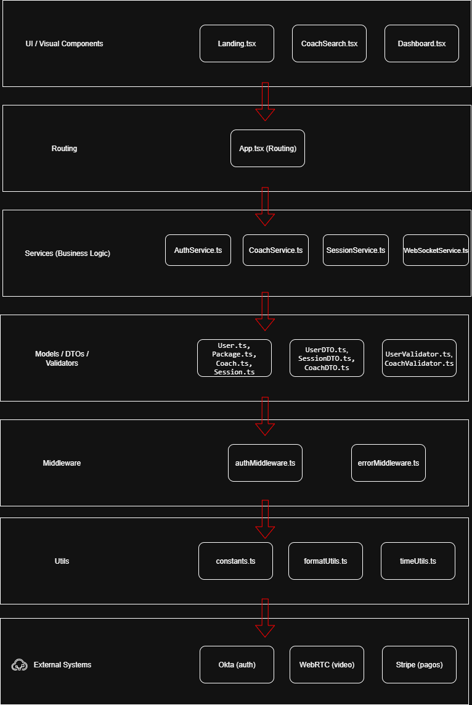

# 20minCoach - Frontend Architecture

## 📋 Proyect Description

20minCoach is a professional coaching platform that connects users with experts in different areas through 20-minute video calls. The architecture is designed with layers to ensure scalability, maintainability, and modularity.

## 🏗️ Layered architecture



### 📁 Folder structure

```
src/
├── 📂 models/              # Data model definitions
│   ├── User.ts
│   ├── Coach.ts
│   ├── Session.ts
│   └── Package.ts
│
├── 🔐 security/            # Authentication and Authorization
│   └── (Prepared for integration with Okta)
│
├── ⚡ middleware/          # Cross-cutting functionalities
│   ├── authMiddleware.ts   # Authentication management
│   └── errorMiddleware.ts  # Centralized error handling
│
├── 🔧 services/           # Bussines logic
│   ├── AuthService.ts     # Authemtication
│   ├── CoachService.ts    # Coach management
│   ├── SessionService.ts  # Session management
│   └── WebSocketService.ts # Real-time communication
│
├── 🔄 background/         # Background processes
│   └── (Automatic reconnection, offline data caching )
│
├── ✅ validators/         # Data validation
│   ├── userValidator.ts
│   └── coachValidator.ts
│
├── 📤 dtos/              # Data Transfer Objects
│   ├── UserDTO.ts
│   ├── CoachDTO.ts
│   └── SessionDTO.ts
│
├── 🗺️ routing/           # Navigation system
│   └── App.tsx (Routes configuration)
│
├── 🎨 components/        # Reusable components
│   ├── layout/           # Main layouts
│   ├── coach/            # Coach-specific components
│   ├── session/          # Session components
│   └── ui/               # Base components (shadcn)
│
├── 📱 pages/             # Main pages
│   ├── Landing.tsx       # Home page
│   ├── Dashboard.tsx     # User dashboard
│   └── CoachSearch.tsx   # Coach search page
│
├── 🛠️ utils/            # Date and time handling
│   ├── timeUtils.ts      # Date and time management
│   ├── formatUtils.ts    # Data formatting
│   └── constants.ts      # Global constants
│
└── 🧪 __tests__/         # Unit tests
    └── (Jest + React Testing Library)
```

## 🎯 Main Features

### ✨ Design System
- **Semantic tokens** defined in `index.css`
- **HSL colors** for consistency
- **Professional gradients** for an attractive UI
- **Smooth animations** using cubic-bezier
- **Responsive design** with Tailwind CSS

### 🔗 Core Services

#### AuthService
- JWT token management
- Automatic token refresh
- Secure storage in localStorage
- Prepared for Okta integration

#### CoachService
- Coach search and filtering
- Profile management
- Real-time availability status

#### SessionService
- Session creation and management
- Joining video calls
- Rating system

#### WebSocketService
- Real-time communication
- Automatic reconnection
- State event management

### 📊 Data Models

#### User
```typescript
interface User {
  id: string;
  email: string;
  firstName: string;
  lastName: string;
  role: UserRole;
  preferences: UserPreferences;
}
```

#### Coach
```typescript
interface Coach {
  id: string;
  userId: string;
  bio: string;
  specialties: Specialty[];
  rating: number;
  availability: Availability;
  status: CoachStatus;
}
```

#### Session
```typescript
interface Session {
  id: string;
  clientId: string;
  coachId: string;
  scheduledAt: Date;
  duration: number;
  status: SessionStatus;
  connectionData: SessionConnection;
}
```

## 🚀 Technologies Used

- **Frontend Framework**: React 18 + TypeScript
- **Build Tool**: Vite
- **Styling**: Tailwind CSS + shadcn/ui
- **State Management**: TanStack Query
- **Routing**: React Router v6
- **Validation**: Zod
- **Date/Time**: date-fns
- **Icons**: Lucide React

## 🔐 Security

### Okta Integration Ready
The architecture is prepared to integrate Okta as an identity provider:

1. **AuthService** can be extended to use the Okta SDK
2. **Authentication middleware** supports OAuth tokens
3. **Roles and permissions** ready for integration

### Security Features
- Input validation with Zod
- Secure token handling
- Route protection
- Centralized error management

## 📱 Implemented Features

### ✅ Current Version
- ✅ Professional landing page
- ✅ User dashboard
- ✅ Coach search with filters
- ✅ Complete navigation system
- ✅ Reusable components
- ✅ Responsive design
- ✅ Layered architecture
- ✅ Form validation
- ✅ Error management

### 🔄 Upcoming Features
- 📹 WebRTC integration for video calls
- 🔔 Real-time notifications system
- 💳 Payment integration
- 📊 Coach dashboard
- 🎯 Availability management system
- 🌐 Multi-language support

## 🧪 Testing

### Test Structure
```
__tests__/
├── components/        # Component tests
├── services/          # Service tests
├── utils/             # Utility tests
└── integration/       # Integration tests
```

### Tools
- **Jest**: Testing framework
- **React Testing Library**: Component testing
- **MSW**: Mock Service Worker for APIs
- **Cypress**: End-to-end testing
## 📦 Installation & Development

```bash
# Install dependencies
npm install

# Run in development
npm run dev

# Run tests
npm test

# Build for production
npm run build
```

## 🎨 Design System

### Main Colors
- **Primary**: Professional Blue (#1e40af)
- **Secondary**: Trust Green (#059669)
- **Success**: Coaching Green (#16a34a)
- **Warning**: Professional Orange (#ea580c)

### Gradients
- **Hero**: Blue-Green linear gradient
- **Card**: Subtle gradient for cards
- **Button**: Gradient for primary buttons

### Components
- Cards with soft shadows
- Buttons with hover states
- Badges for specialties
- User avatars
- Status indicators

## 🔮 Integration Roadmap

### Phase 1: Authentication (Okta)
- Okta SDK setup
- Login/logout flows
- Session management

### Phase 2: Video Calls (WebRTC)
- WebRTC integration
- Waiting room
- Audio/video controls

### Phase 3: Real-Time (WebSockets)
- Coach status updates
- Push notifications
- Real-time chat

### Phase 4: Payments (Stripe)
- Payment processing
- Package management
- Invoicing

## 📞 Contact & Support

For questions about architecture or implementation, consult the technical documentation or contact the development team.

---

**Version**: 1.0.0  
**Last update**: September 2025  
**Status**: Active development 🚧
